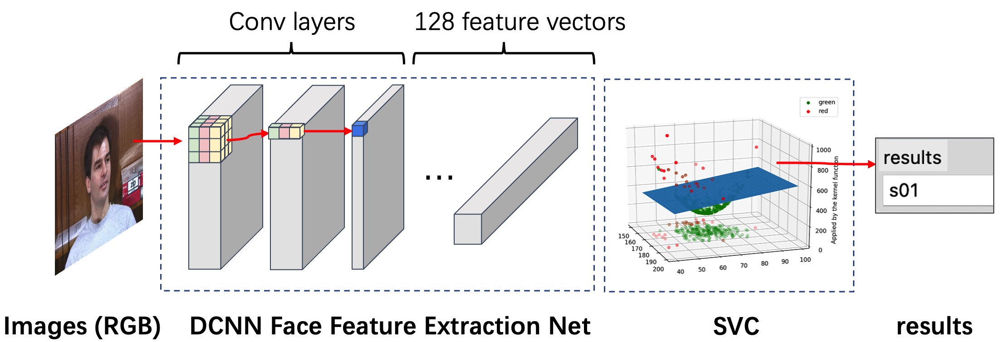
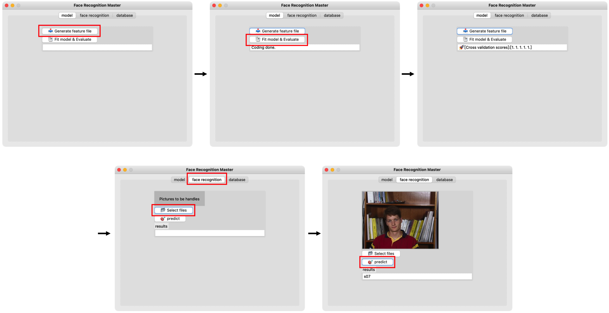

# 简单的GUI人脸识别应用

> This readme file also provide an English version, please refer to [README_en.md](README_en.md)

这是一个简单的基于Python库 `face_recognition` 的人脸识别应用，兼容Windows、Linux、MacOS，无需PyTorch、Tensorflow等深度学习框架，仅需Python3.6+即可运行

要开始的话，你只需要：

1. 克隆本仓库: `git clone https://github.com/HaoyuCui/Simple-Face-Recognition.git`

2. 进入到本文件夹中` cd Simple-Face-Recognition`

3. 安装依赖环境 `pip install -r requirements.txt` ，安装过程会自动开始

4. 该项目在数据集 **[Georgia Tech face database](http://www.anefian.com/research/gt_db.zip)** 上训练并测试，下载并替换该目录下的 'gt_db' 文件夹， 在那之后，你的文件夹结构应该是这样的:

    ```
    gt_db
    ├─ s01
    │    ├─ 01.jpg
    │    ├─ ...
    │    └─ 15.jpg
    ├─ ...
    └─ s50
    ```

   你可以将该目录替换为你自己的数据集，请参照该结构  `gt_db/<姓名>/<对应所有照片>`，每个人的照片数量不限（推荐每人1~5张） 
5. 使用`python UI.py`命令运行，你可以选择功能区域的'Generate feature file'手动生成一个pickle文件，对于该数据集，生成该文件大约需要5分钟（不推荐）

6. Tip: 你可以前往该仓库了解人脸识别库的更多信息: [face-recognition](https://github.com/ageitgey/face_recognition)

    

7. 选择'Fit model & Evaluate'来训练一个SVM分类器，你可以选择图片文件来测试该模型，准确率可以达到98.66%

8. 整体流程如下:

   

